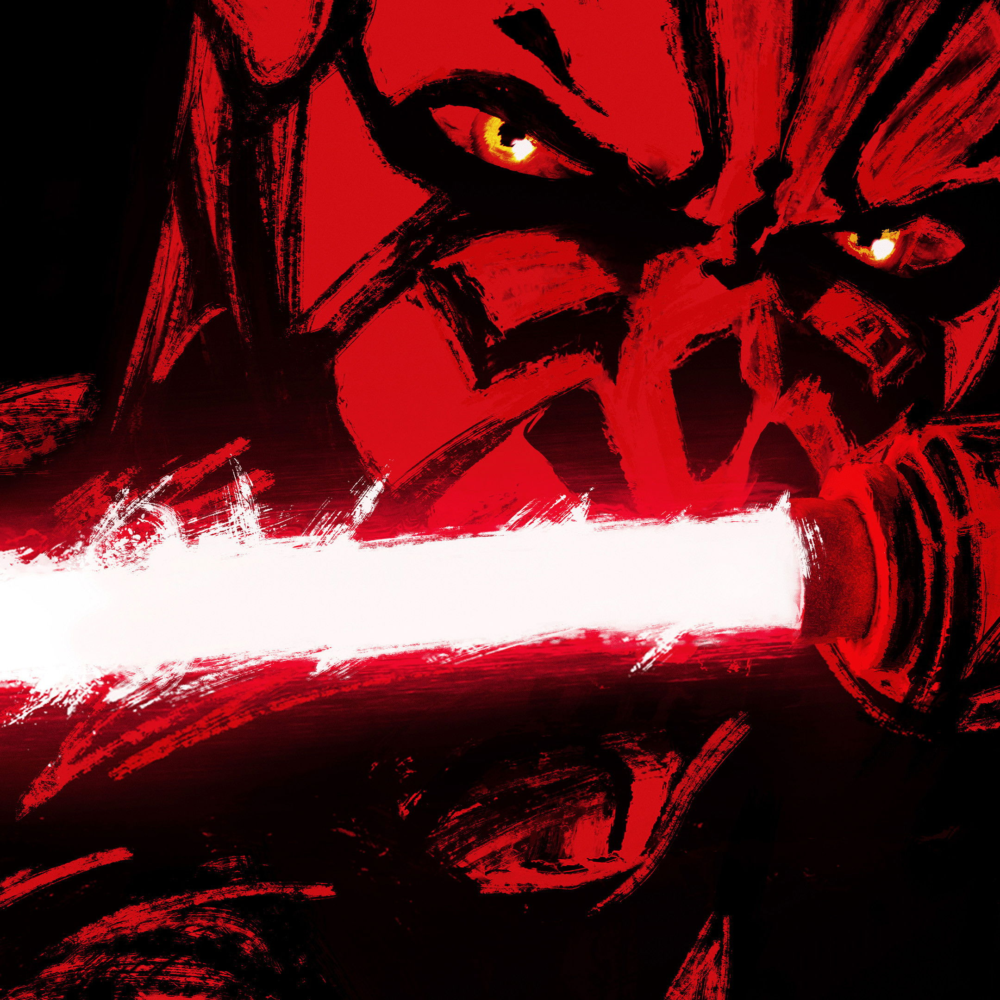
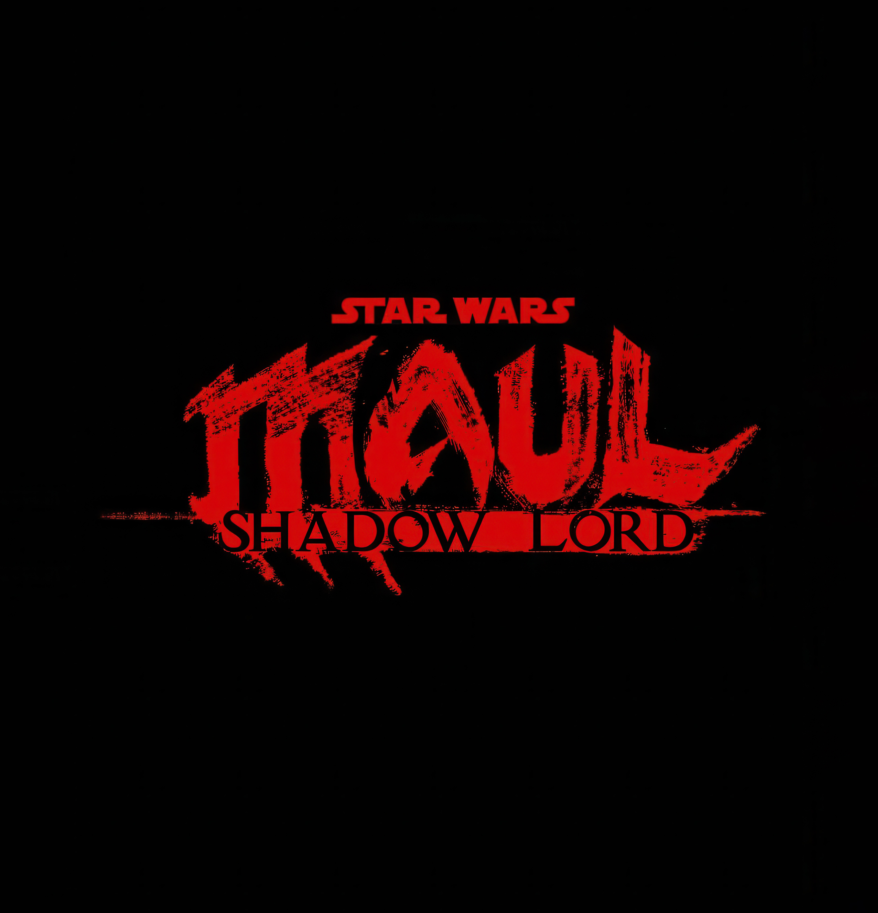
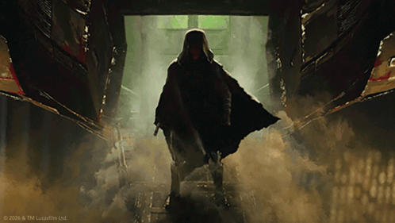
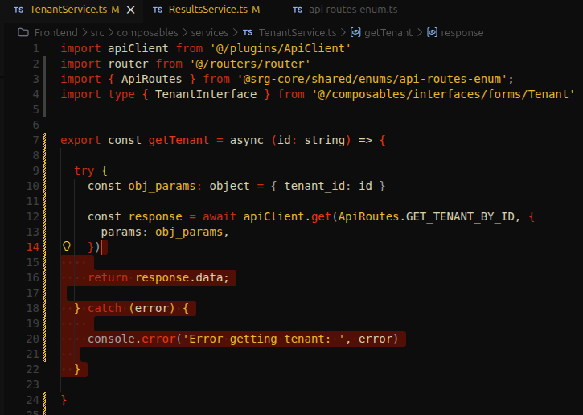
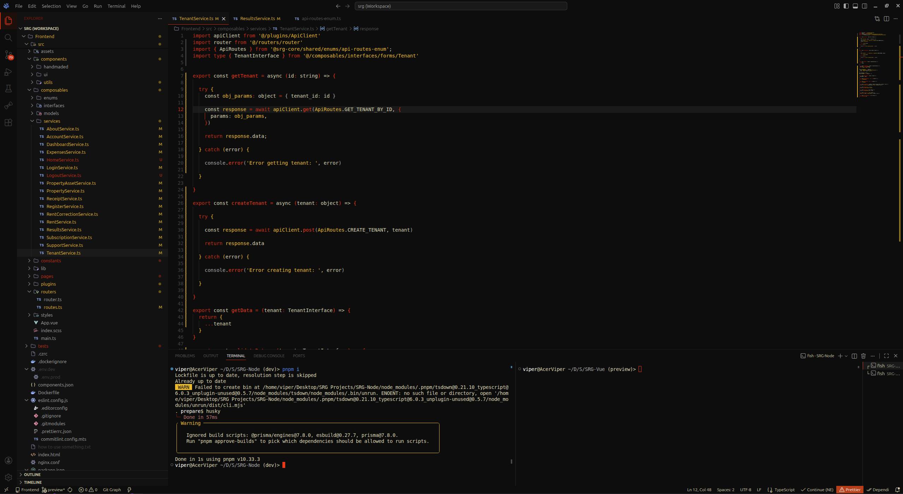
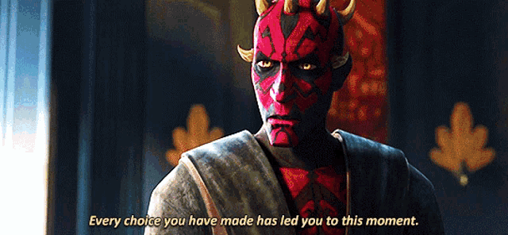
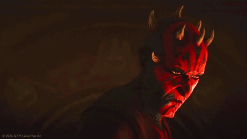

<h1 align="center">Maul, Shadow Lord - Son of Dathomir</h1>

 

  

<h2 align="center">Embrace the Dark Side and together we will destroy the Emperor...</h2>

<h3 align="center">Inspired by Maul, Shadow Lord Series</h3>

<h4 align="center"><i>"Formerly Darth, now just Maul."</i></h4>

  </img>

<h2 align="center">VSCodium Theme - Screenshots</h2>

  I will update this later when i have screenshots, lol

<h3 align="center">Sith Holocron</h3>

<h3 align="center">Sith Temple</h3>

<h3 align="center">Unleash your true power, download this theme and</h3>
<h4 align="center"><i>"Can I count on you?"</i></h4>

  </img>

## Important

If you have problems using this theme, open a [Issue](https://github.com/V-Perotto/Grape-Glass-Theme/issues/new) and send a screenshot to analyse your request (_check if there is an extension that may be causing these issues, or maybe some Jedis_).

### In case you think this theme isn't for you...

<h4 align="center"><i>"I was hoping for Kenobi, why are you here?"</i></h4>

  </img>

  Created by <a href="https://github.com/V-Perotto">V-Perotto</a> and published on <a href="https://open-vsx.org/namespace/DistroLinux">Open VSX - DistroLinux</a> with <a href="http://opensource.org/licenses/MIT">MIT  © Licence</a> 

